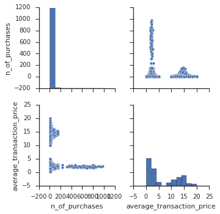
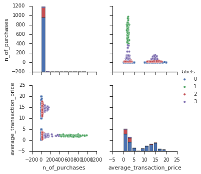

_Suppose we want to cluster our customers according to their buying behavior, e.g. their purchase frequency. The Kmeans function in scikit will enable us to do that.
_


```python
import pandas as pd
import contiamo
import datetime

import seaborn as sns
import numpy as np

from sklearn.cluster import KMeans
from sklearn import datasets
```

    /opt/conda/lib/python3.5/site-packages/matplotlib/font_manager.py:273: UserWarning: Matplotlib is building the font cache using fc-list. This may take a moment.
      warnings.warn('Matplotlib is building the font cache using fc-list. This may take a moment.')
    /opt/conda/lib/python3.5/site-packages/matplotlib/font_manager.py:273: UserWarning: Matplotlib is building the font cache using fc-list. This may take a moment.
      warnings.warn('Matplotlib is building the font cache using fc-list. This may take a moment.')


### Query data into Contiamo


```python
transactions = %contiamo query query:sql:48590597:411:g71GXzJjsx4Uvad11ouKjoYbQUNNPy-qRMKkBNZfyx4
customers = %contiamo query query:sql:48590597:441:MG5W2dMjXzYgsHsgdQYzmhv44dxEQX2Lodu5Uh2Hx_s
applications = %contiamo query query:sql:48590597:442:-gz3nbw1fdmtSXkD4zGNA-cVa7s6sQtRn8upCSn6uys            
```


```python
df = pd.DataFrame({
        'customer_id' : transactions['Field customer id'],
        'revenue' : pd.to_numeric(transactions['Field app price']),
        'n_of_purchases' : [1]*len(transactions)
    })
df.head()
```


<div>
<table border="1" class="dataframe">
  <thead>
    <tr style="text-align: right;">
      <th></th>
      <th>customer_id</th>
      <th>n_of_purchases</th>
      <th>revenue</th>
    </tr>
  </thead>
  <tbody>
    <tr>
      <th>0</th>
      <td>2F65fA7Cd10cbFFD</td>
      <td>1</td>
      <td>4.99</td>
    </tr>
    <tr>
      <th>1</th>
      <td>2F65fA7Cd10cbFFD</td>
      <td>1</td>
      <td>0.19</td>
    </tr>
    <tr>
      <th>2</th>
      <td>2F65fA7Cd10cbFFD</td>
      <td>1</td>
      <td>0.99</td>
    </tr>
    <tr>
      <th>3</th>
      <td>44dEeeb9eEF3ff64</td>
      <td>1</td>
      <td>19.99</td>
    </tr>
    <tr>
      <th>4</th>
      <td>44dEeeb9eEF3ff64</td>
      <td>1</td>
      <td>14.99</td>
    </tr>
  </tbody>
</table>
</div>


# Clustering


```python
pf = df.groupby('customer_id').agg({
        'revenue' : 'sum',
        'n_of_purchases' : 'sum'
    })
pf['average_transaction_price'] = pf['revenue'] / pf['n_of_purchases']

del pf['revenue']

pf.head()
```


<div>
<table border="1" class="dataframe">
  <thead>
    <tr style="text-align: right;">
      <th></th>
      <th>n_of_purchases</th>
      <th>average_transaction_price</th>
    </tr>
    <tr>
      <th>customer_id</th>
      <th></th>
      <th></th>
    </tr>
  </thead>
  <tbody>
    <tr>
      <th>000088f2dD0AC5B0</th>
      <td>3</td>
      <td>1.730000</td>
    </tr>
    <tr>
      <th>00031218886cf4c3</th>
      <td>3</td>
      <td>0.260000</td>
    </tr>
    <tr>
      <th>0003774A9BaEceB1</th>
      <td>3</td>
      <td>4.990000</td>
    </tr>
    <tr>
      <th>000a27a08c360eD6</th>
      <td>6</td>
      <td>1.273333</td>
    </tr>
    <tr>
      <th>000a7ac571aaC3e9</th>
      <td>15</td>
      <td>1.818667</td>
    </tr>
  </tbody>
</table>
</div>


```python
%matplotlib inline
sns.set(style="ticks", color_codes=True)
```


```python
g = sns.pairplot(pf)
```





```python
estimator = KMeans(n_clusters=4)

estimator.fit(pf)
labels = estimator.labels_
pf["labels"] = labels
```


```python
g = sns.pairplot(pf, vars=['n_of_purchases', 'average_transaction_price'], hue="labels")

```





We can see that 4 distinct groups have been create : One group of customer having a low purchase frequency and buying expensive apps (label 0), one group having a high purchase frequency and buying cheap apps (label 1), one group of customers having a low purchase frequency and buying cheap apps (label 2) and finally, one group of customer having an intermediate purchase frequency (label 4).  
A new column has been added in our data frame containing that information. So we could observe each group’s buying behavior even further by uploading the new data frame into Contiamo and exploring the data filtered by cluster in the Explore section. 

